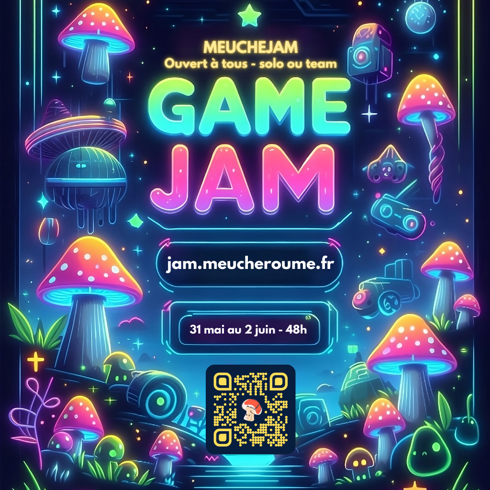

import Preinscriptions from "../components/_Preinscriptions.md"
import Countdown from "../components/Countdown"

<Countdown targetDate="2024-06-07T19:00:00"/>
 

**Bienvenue dans la MeucheJam !** Une GameJam créée et imaginée par la MeucheTeam ! Le but est de faire une Jam ouverte à tous et à toutes en solo ou en team, en tant que dev ou artiste, tout le monde est convié !!

:::tip
Pour ne rater aucune info, au choix :
<Preinscriptions/>
:::

:::info Qu'est-ce qu'une Game Jam ?
Une GameJam c'est un évènement où l'on développe son propre jeu vidéo le temps d'un weekend. Souvent sur un thème et une contrainte donné.es. Le tout dans une ambiance décontractée et fun, le but est avant tout de s'amuser et progresser quel que soit ton niveau !
:::

Si vous êtes streamer, vous pourrez nous envoyer votre POV et on passera vous voir de temps en temps sur la [MeucheTV](https://www.twitch.tv/meucheroume).

Et si vous n'êtes pas streamer, pas de souci, vous aurez le droit à tout autant de fun !

:::tip Trouve ton équipe !
Si vous ne vous sentez pas de faire la jam seul.e, et que vous n'avez pas d'équipe, vous pouvez en chercher une [sur le discord](https://discord.gg/YhvRqS2wMC).
:::

